## Hackathon: NeoxCinema
***

#### ¿Por qué? 
¿Quién no tiene un amigo fanático de Marvel?, he ahí nuestro punto de inicio. Debido a esta alta demanda de fanáticos de Marvel, decidimos crear esta plataforma.

#### Descripción: NeoCinema 
Creada por fanáticos para fanáticos de Marvel que quieren encontrar en un solo lugar las películas, comics, información en general de sus personajes favoritos.

#### Objetivo:
Desarrollar un sitio Web que resuelva las necesidades de los usuarios en el consumo específicamente de productos de Marvel, brindándoles facilidades para la búsqueda de películas, comics, información de los personajes, series, etc. Todo referido a las producciones de Marvel y poder obtener toda la información.

#### Publico Objetivo
 + Fanáticos de los produtos de Marvel.
 + Público en General.

### Flujo de trabajo

Organizamos las tareas  mediante una serie de pasos :

---
+  Nos reunimos para elegir el tema y trazarnos objetivos.
+  Realizamos entrevistas a un grupo pequeño de usuarios.
+ Reconocimiento de necesidades y requerimientos de los usuarios.
+  Realización de  sketchs de las vistas.  
+  Designación de tareas:
- Jennifer: login con Facebook y Google.
- Jymma: Vista de introducción, uso de FIREBASE para el login.
- Kamaly: Investigación del API de OMDB y Marvel.
- Flora: vista principal.
+  Maquetación de las vistas.
+  Investigación.

# Primer sketch

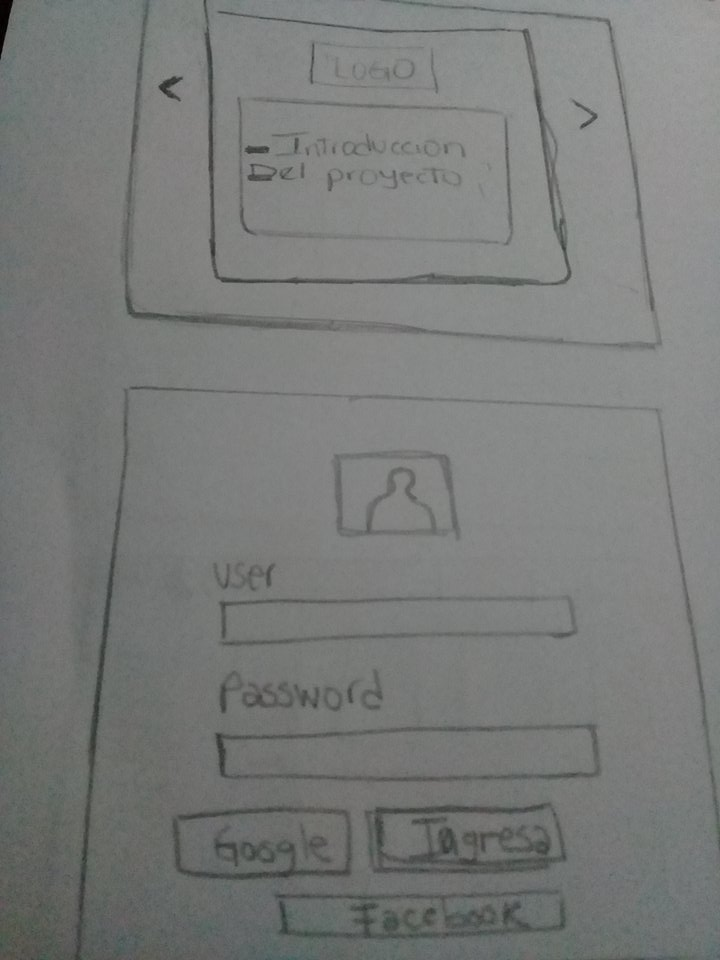
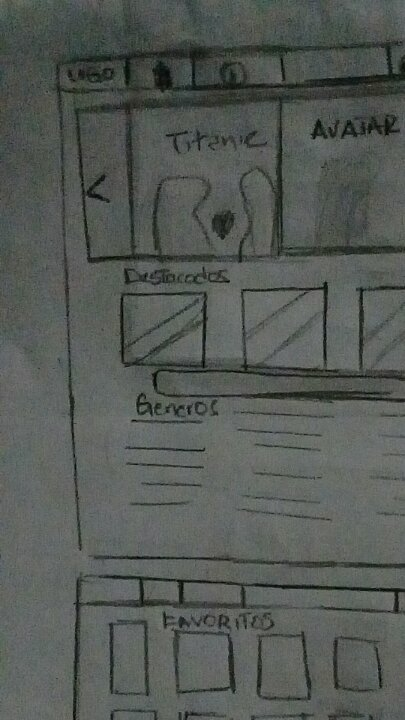
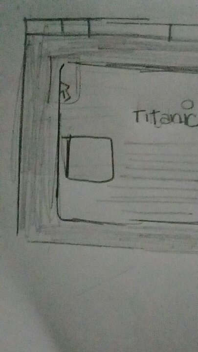

# Elección de opciones por cada API
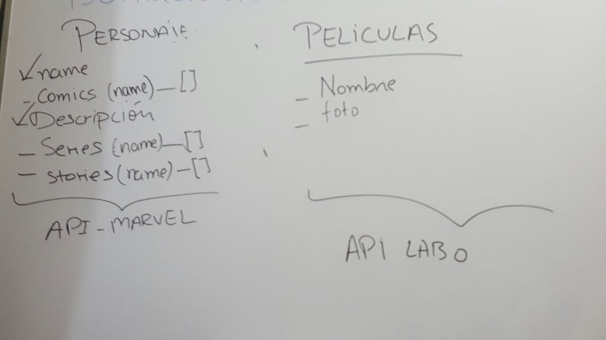
# Programación de tareas por día
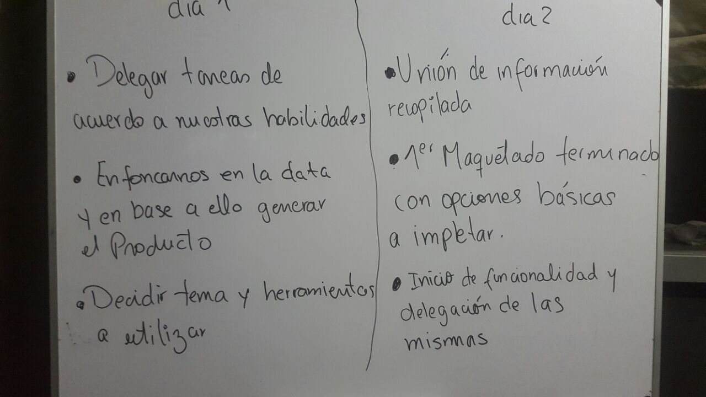
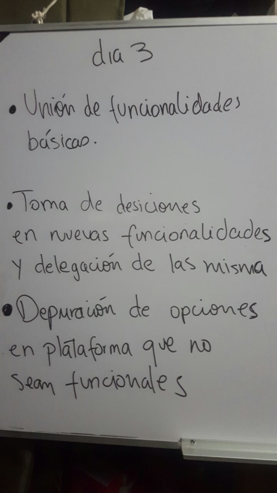
## Ultimo día (4)
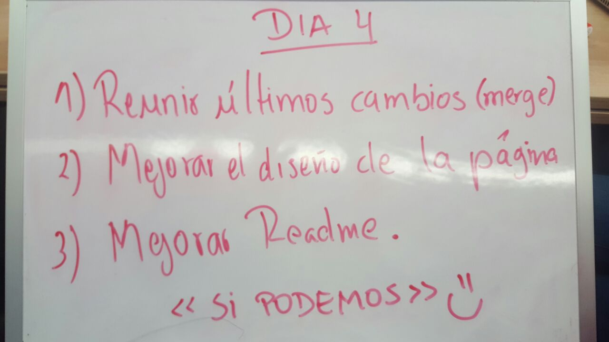

#### 3. Recursos adicionales utilizados
* BOOTSTRAP (estrucutra y diseño)
* JQUERY v3.2.1. (funcionalidad)
* papel, lapiz, pizarra (sketchs)
* API de Marvel (data)
* API Google maps (data)
* API OMDB  (data)
* Firebase (backend)

#### 4. Integrantes
* Kamaly Zapana.
* Jennifer Milagros Carmen.
* Flora Maria Huerta.
* Jymma Mogollon.

* ¿Te gusto lo hemos hecho para ti? Qué esperas anímate y regístrate en NeoxCinema

#### 5. Producto
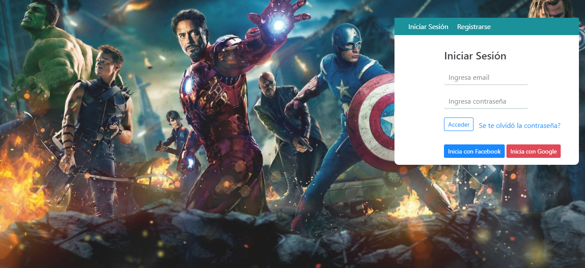
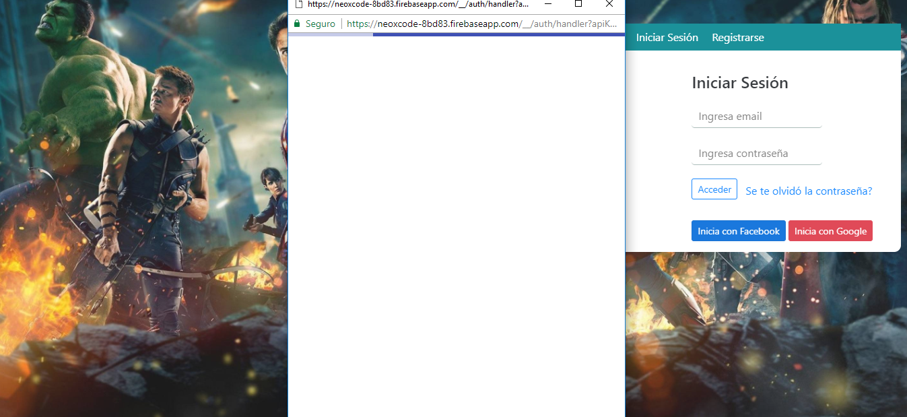
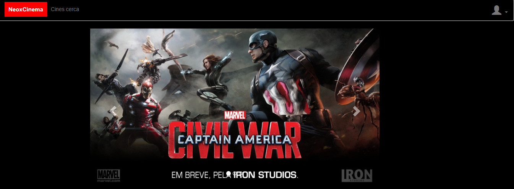
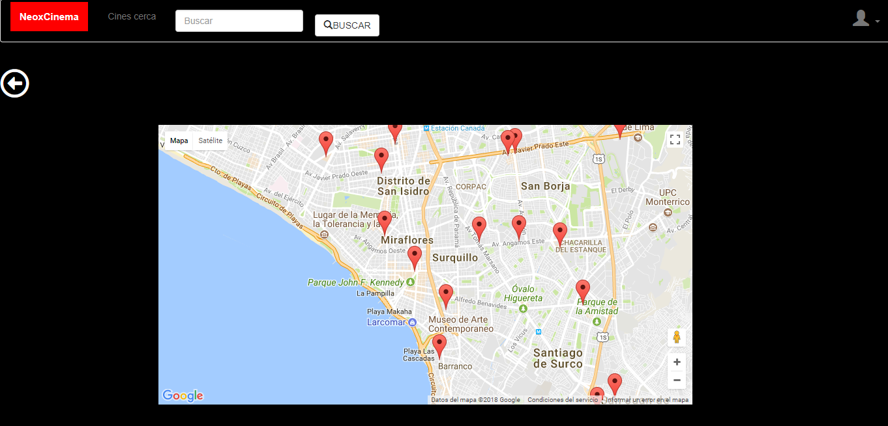
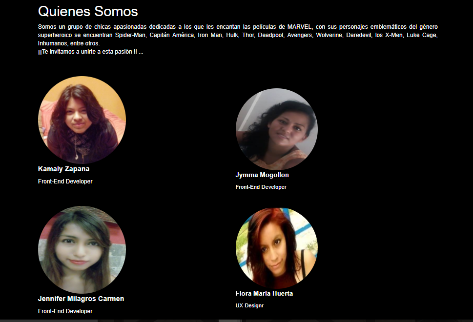

